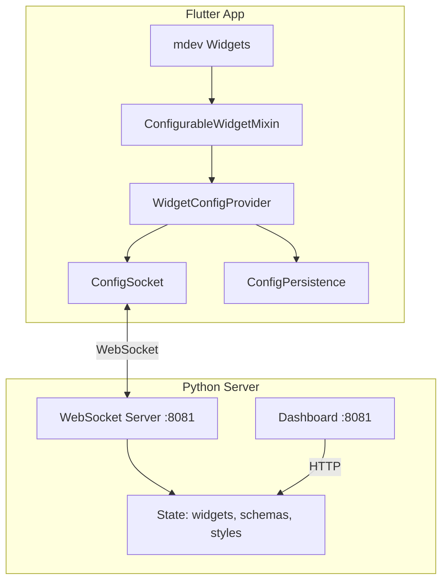
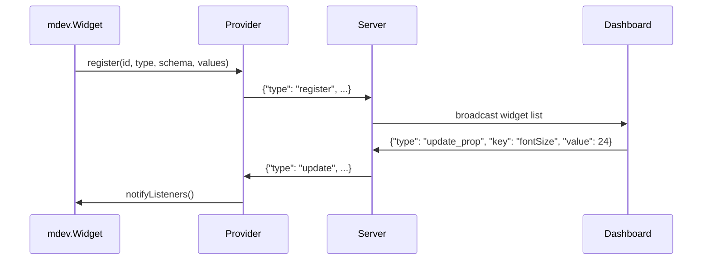
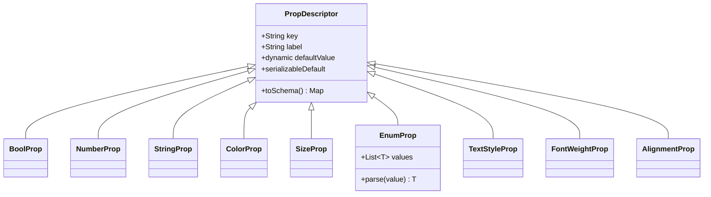

# CLAUDE.md

This file provides guidance to Claude Code (claude.ai/code) when working with code in this repository.

## Project Overview

Flutter package for dynamic widget configuration with stack-based ID extraction. Widgets auto-register with a config system that syncs with a Python WebSocket server for live editing via web dashboard.

**Structure:**
- `mdev_widgets/` - The main Flutter package
- `mdev_widgets_demo/` - Full demo app with tabbed widget examples
- `mdev_widgets/server/` - Python WebSocket server + web dashboard

## Build & Run Commands

Use the Makefile (run `make` to see interactive menu):

```bash
make server      # Run Python config server (auto-reloads on file changes)
make demo        # Run widgets demo app in Chrome
make all         # Run server (background) + demo app
make analyze     # Analyze all packages
make test        # Run all tests (Python + Flutter)
make dashboard   # Open http://localhost:8081 in browser
make stop-server # Stop background server
```

Run a single Flutter test:
```bash
cd mdev_widgets && flutter test test/models/widget_config_test.dart
```

## Architecture



### Data Flow



### Schema-Driven Configuration



Widgets define properties using typed descriptors that generate both UI controls and serialization logic:

```dart
static final props = [
  CommonProps.visible,
  CommonProps.highlight,
  TextStyleProp('textStyle', label: 'Text Style'),
  SizeProp('fontSize', label: 'Font Size'),
  ColorProp('color', label: 'Color'),
];
```

## Usage Pattern

```dart
import 'package:mdev_widgets/mdev_widgets.dart' as mdev;

void main() async {
  WidgetsFlutterBinding.ensureInitialized();
  final setup = await mdev.MdevSetup.init();

  // Register app-specific styles (colors support light/dark themes)
  setup.provider.registerColor('primary', light: '#6200ee', dark: '#bb86fc');
  setup.provider.registerSize('spacing-md', 16.0);

  runApp(setup.wrapApp(const MyApp()));
  setup.connect();
}

// Use widgets with mdev prefix
mdev.Column(children: [
  mdev.Text('Hello'),
  mdev.AppBar(title: Text('My App')),
])
```

## Key Components

| Component | Purpose |
|-----------|---------|
| `MdevSetup` | Entry point: initializes provider, socket, provides `wrapApp()` |
| `WidgetConfigProvider` | Central ChangeNotifier managing configs and StyleRegistry |
| `ConfigurableWidgetMixin` | Shared registration and build patterns for widgets |
| `ConfigSocket` | WebSocket client with auto-reconnect (exponential backoff) |
| `extractCallerId()` | Parses `StackTrace.current` for unique widget IDs |

### Stack-Based Widget Identification

`extractCallerId()` in `stack_id_mixin.dart` generates IDs like `[innerFunc] outerFunc > parent (file.dart:line:col)` by parsing the call stack. Each unique code location gets a unique ID. Platform-specific parsing for VM vs Web.

### Hot Restart Handling (Flutter Web)

Uses browser `sessionStorage` to detect stale providers. Each provider stores a unique session ID; server updates check `isCurrentSession` before processing.

## WebSocket Protocol

```json
{"type": "register", "id": "...", "widgetType": "Text", "properties": {...}, "schema": [...]}
{"type": "update_prop", "id": "...", "key": "fontSize", "value": 24}
{"type": "styles", "data": {"colors": {...}, "sizes": {...}, "textStyles": {...}}}
{"type": "reset", "id": "..."}
{"type": "reset_all"}
```

## Server

Dashboard at http://localhost:8081 (WebSocket on same port).

- `config_server.py` - WebSocket server with auto-reload on file changes
- `dashboard.html` - Schema-driven UI that auto-generates controls from widget schemas

## Dependencies

- **Dart SDK:** ^3.10.8
- **Package:** provider, web, web_socket_channel, shared_preferences
- **Python server:** websockets >=12.0 (in `.venv`)

## Widget Roadmap

**Current widgets (7):** Text, Column, Row, Padding (individual edge control), Wrap, Stack, AppBar

```mermaid
graph LR
    subgraph "Phase 1: Layout Essentials"
        Container
        SizedBox
        Center
        Expanded
        Flexible
    end

    subgraph "Phase 2: Interactive"
        ElevatedButton
        IconButton
        TextField
        Checkbox
        Switch
    end

    subgraph "Phase 3: Material"
        Card
        Scaffold
        Drawer
        BottomNavigationBar
        FloatingActionButton
    end

    subgraph "Phase 4: Advanced"
        ListView
        GridView
        TabBar
        Dialog
        BottomSheet
    end

    Phase 1 --> Phase 2 --> Phase 3 --> Phase 4
```

### Phase 1: Layout Essentials
| Widget | Configurable Properties | Notes |
|--------|------------------------|-------|
| `Container` | padding, margin, color, width, height, alignment, decoration | Most versatile layout widget |
| `SizedBox` | width, height | Simple sizing/spacing |
| `Center` | widthFactor, heightFactor | Centering wrapper |
| `Expanded` | flex | Flex child widget |
| `Flexible` | flex, fit | Flexible flex child |

### Phase 2: Interactive Widgets
| Widget | Configurable Properties | Notes |
|--------|------------------------|-------|
| `ElevatedButton` | backgroundColor, foregroundColor, elevation, padding | Primary action button |
| `TextButton` | foregroundColor, padding | Text-only button |
| `IconButton` | icon, color, iconSize, padding | Icon-only button |
| `TextField` | decoration, style, maxLines | Text input |
| `Checkbox` | activeColor, checkColor | Toggle input |
| `Switch` | activeColor, activeTrackColor | On/off toggle |

### Phase 3: Material Components
| Widget | Configurable Properties | Notes |
|--------|------------------------|-------|
| `Card` | elevation, color, margin, shape | Material card |
| `Scaffold` | backgroundColor, appBar config | Page structure |
| `Drawer` | backgroundColor, width | Side navigation |
| `BottomNavigationBar` | backgroundColor, selectedItemColor | Bottom nav |
| `FloatingActionButton` | backgroundColor, foregroundColor | FAB |
| `Divider` | color, thickness, indent | Visual separator |

### Phase 4: Advanced Widgets
| Widget | Configurable Properties | Notes |
|--------|------------------------|-------|
| `ListView` | padding, scrollDirection, physics | Scrollable list |
| `GridView` | crossAxisCount, spacing, padding | Grid layout |
| `TabBar` | labelColor, indicatorColor | Tab navigation |
| `AlertDialog` | backgroundColor, titleTextStyle | Modal dialog |
| `BottomSheet` | backgroundColor, elevation | Bottom modal |
| `Chip` | backgroundColor, labelStyle, avatar | Compact element |

### Adding a New Widget

1. Create `lib/src/widgets/<widget_name>.dart`
2. Define props class with `PropDescriptor` list
3. Use `ConfigurableWidgetMixin` for registration
4. Export from `lib/mdev_widgets.dart`
5. Add demo to `mdev_widgets_demo`
6. Add tests to `test/widgets/`

Example structure:
```dart
class MyWidgetProps {
  static const myProp = StringProp('myProp', label: 'My Property');
  static final List<PropDescriptor> all = [
    CommonProps.visible,
    CommonProps.highlight,
    myProp,
  ];
}

class MyWidget extends StatefulWidget {
  final String callerId = extractCallerId();
  // ... widget implementation using ConfigurableWidgetMixin
}
```
